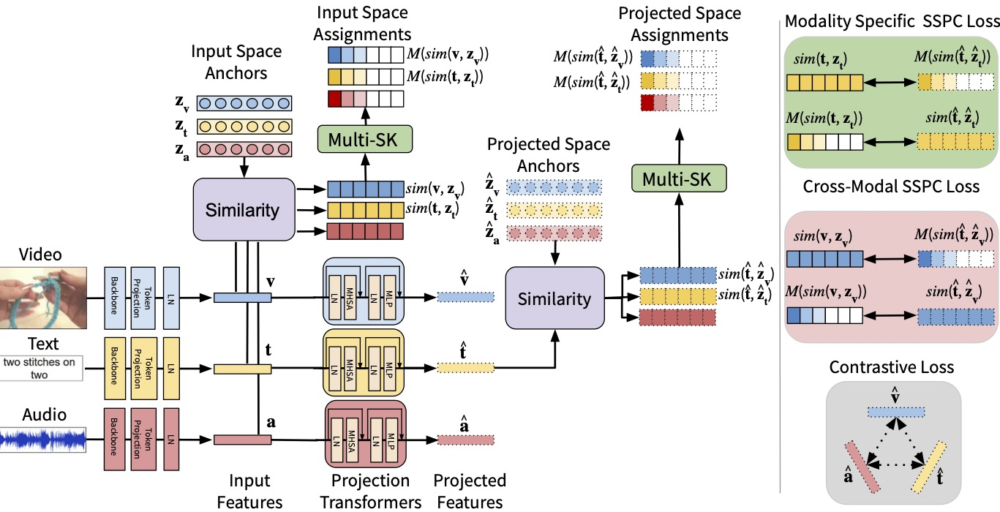

# Preserving Modality Structure Improves Multi-Modal Learning

[Swetha, Sirnam](https://swetha5.github.io/), [Rizve, Mamshad Nayeem](https://nayeemrizve.github.io/), [Shvetsova, Nina](https://ninatu.github.io/), [Kuehne, Hilde](https://hildekuehne.github.io/) and [Shah, Mubarak](https://www.crcv.ucf.edu/person/mubarak-shah/)

[Preserving Modality Structure Improves Multi-Modal Learning](https://openaccess.thecvf.com/content/ICCV2023/papers/Swetha_Preserving_Modality_Structure_Improves_Multi-Modal_Learning_ICCV_2023_paper.pdf)




Accepted at ICCV 2023!

Repository contains:
* Training Code
* Model Weights
* Fine-tuning and evaluation datasets: MSR-VTT and YouCook2

## Get started

1. Create an environment:
   ```
   conda create python=3.8 -y -n multisk
   conda activate multisk 
   conda install -y pytorch==1.7.0 torchvision==0.8.0 torchaudio==0.7.0 cudatoolkit=10.2 -c pytorch
   pip install gensim==3.8.0 sacred==0.8.2 humanize==3.14.0 transformers==4.10.2 librosa==0.8.1 timm==0.4.12
   ```
2. If needed, download `data.tar` with features and spectrograms to fine-tune 
   and evaluate on YouCook2 and MSR-VTT [here](https://drive.google.com/drive/folders/1Yhq91lQa_2cJFbtAHWfA0JYsXdWUFz9I). Extract a tar:
   `tar -xvf data.tar`


## Pretraining

1. Downloading HowTo100M and feature extraction. Please note that HowTo100M videos require a huge storage, and features alone take up terabytes of space. 
   Features extraction (ResNet-152,ResNeXt-101) and audio spectrogram extraction were carefully described in [https://github.com/roudimit/AVLnet/blob/main/training.md](https://github.com/roudimit/AVLnet/blob/main/training.md).

2. Review `configs/pretraining/resnet_tva.yaml` and make sure `csv`, `features_path`, `features_path_audio`, and `caption_path` point on the correct paths. 
   CSV file should contain one column named 'path' with a list of videos. An example of the CSV file that we used in the training can be found [here (HowTo100M_1166_videopaths.txt)](https://drive.google.com/file/d/1bSzxe95LRfPRb5YMJlYlkvgPmNFBlo5b/view?usp=sharing).
3. Train `python train.py  --config configs/pretraining/resnet_tva.yaml`

## Using the model on your own data

If you want to use the model on your own data, please follow steps described in https://github.com/roudimit/AVLnet for features extraction and audio spectrogram extraction.

## Cite

If you use this code in your research, please cite:

```bibtex
@InProceedings{Swetha_2023_ICCV,
    author    = {Swetha, Sirnam and Rizve, Mamshad Nayeem and Shvetsova, Nina and Kuehne, Hilde and Shah, Mubarak},
    title     = {Preserving Modality Structure Improves Multi-Modal Learning},
    booktitle = {Proceedings of the IEEE/CVF International Conference on Computer Vision (ICCV)},
    month     = {October},
    year      = {2023},
    pages     = {21993-22003}
      }
    
```

## Contact

If you have any problems with the code or have a question, please open an issue or email swetha(dot)sirnam at ucf.edu. 
I'll try to answer as soon as possible.

## Acknowledgments and Licenses

The main structure of the code is based on [everything-at-once](https://github.com/ninatu/everything_at_once) which is built upon [frozen-in-time](https://github.com/m-bain/frozen-in-time).

The code in `davenet.py`, `layers.py`, `avlnet.py` is partly derived from https://github.com/dharwath/DAVEnet-pytorch/, https://github.com/wnhsu/ResDAVEnet-VQ, https://github.com/antoine77340/howto100m, and https://github.com/roudimit/AVLnet, and is licensed under BSD-3 (David Harwath, Wei-Ning Hsu, Andrew Rouditchenko) and Apache License 2.0 (Antoine Miech).
